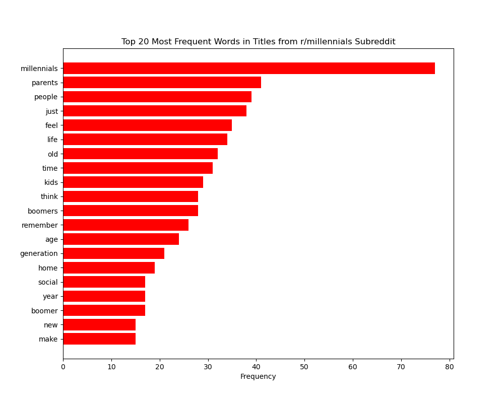
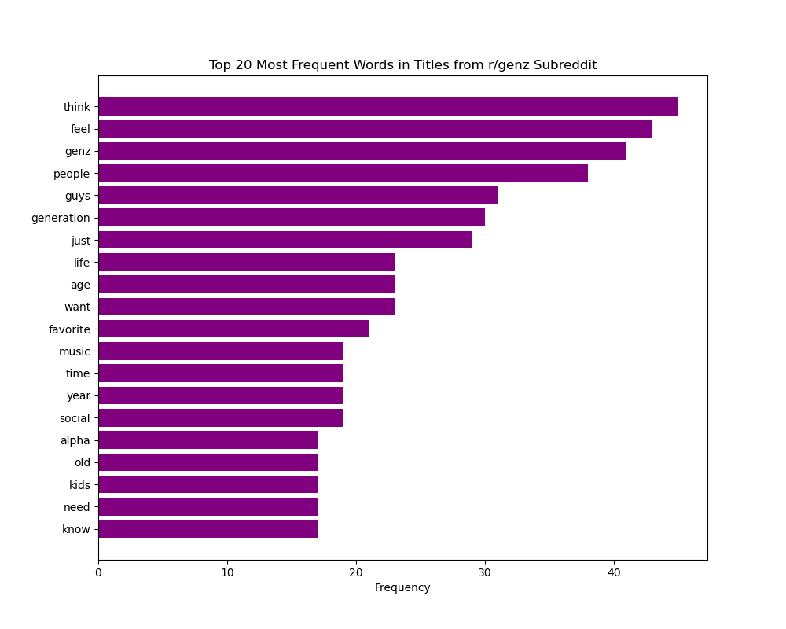
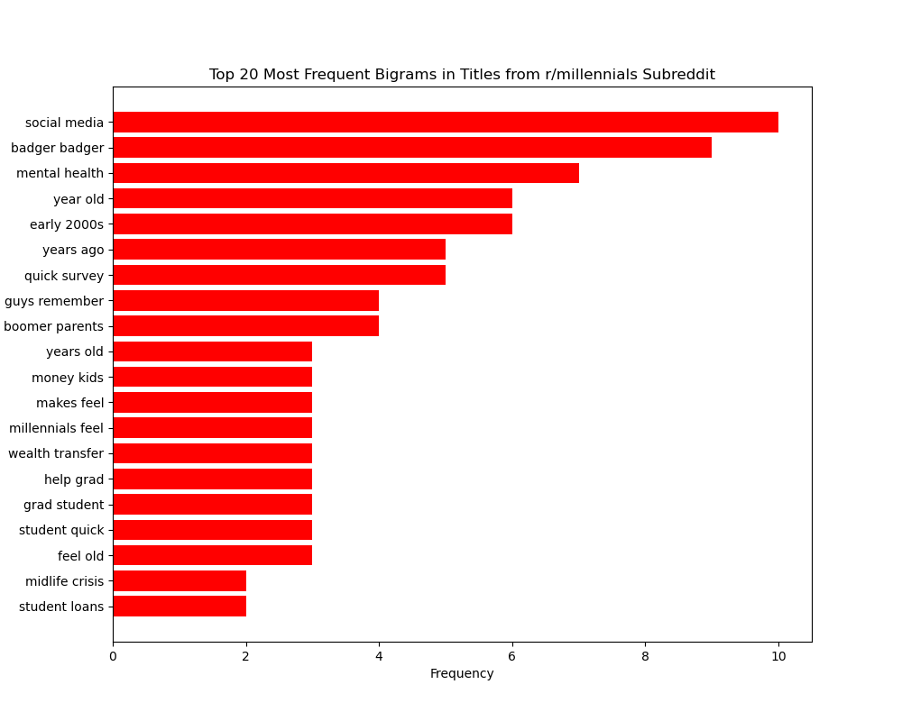
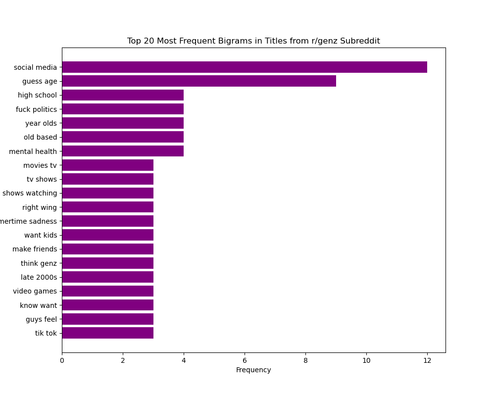
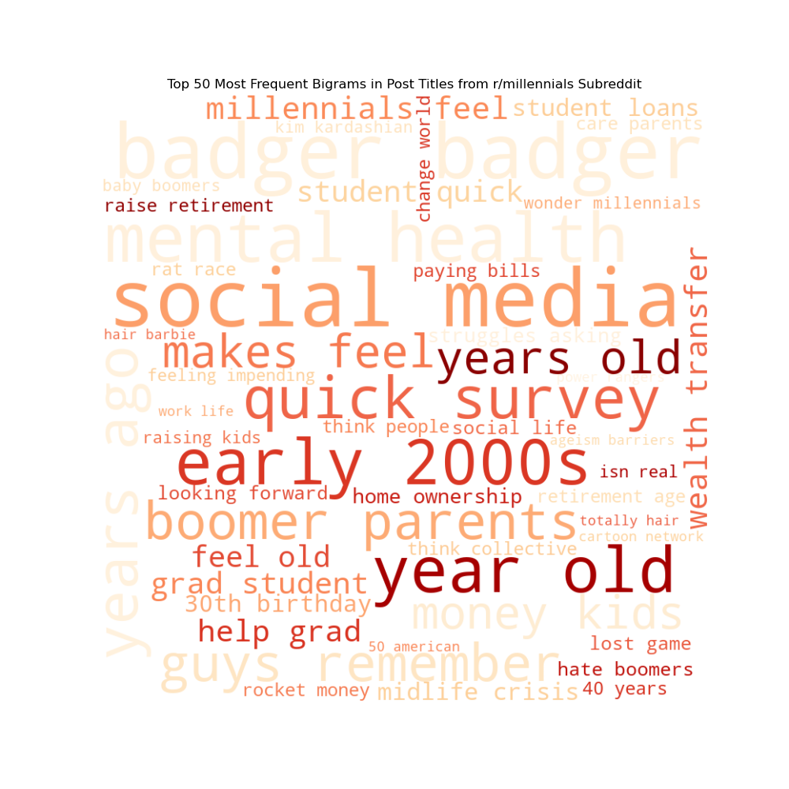
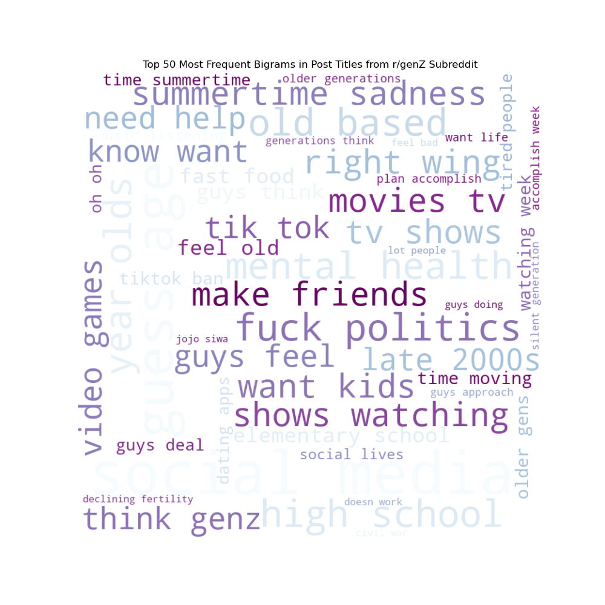
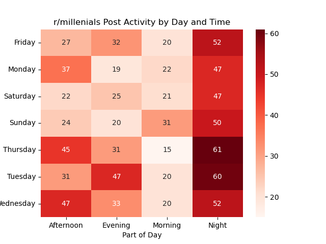
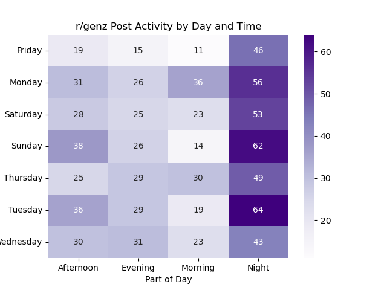

# Generational Marketing Analysis of r/millenials and r/genZ

## Table of Contents

1. [Executive Summary](#Executive-Summary)
2. [Problem Statement](#Problem-Statement)
3. [Data Collection and Preparation](#Data-Collection-and-Preparation)
4. [Data Dictionary](#Data-Dictionary)
5. [Exploratory Data Analysis (EDA) and Visualization](<#Exploratory-Data-Analysis-(EDA)-and-Visualization>)
6. [Model Development and Evaluation](#Model-Development-and-Evaluation)
7. [Conclusions](#Conclusions)
8. [Recommendations](#Recommendations)
9. [Sources](#Sources)
10. [How to Use](#How-to-Use)
11. [Technologies and Libraries](#Technologies-and-Libraries)

## Executive Summary

This project leverages the Python Reddit API Wrapper (PRAW) to gather and analyze data from the r/millennials and r/genZ subreddits. The primary objective is to decode generational nuances in language and themes, helping GenInsight Inc. to fine-tune its digital marketing strategies on Reddit. By dissecting the top 1000 hottest posts from each subreddit, the study reveals common and unique linguistic patterns, providing a base for predictive modeling.

Binary classification models were applied to predict whether a post belongs to the r/millennials or r/genZ subreddit based on its title. The models evaluated include Logistic Regression, Multinomial Naive Bayes, K-Nearest Neighbors, RandomForest, and SVM, with accuracies ranging up to 66%.

The findings suggest that while there is a shared vocabulary across generations, each group also discusses distinct topics that reflect their unique concerns and lifestyles. Millennials tend to focus on issues like economic stability and family dynamics, while Gen Z is more concerned with political, social, and digital media trends.

In conclusion, the project underscores the importance of nuanced marketing approaches that go beyond generic generational labels. The recommendations for GenInsight Inc. include refining data collection strategies, enhancing model features, and reconsidering the broader implications of generational marketing. These strategies aim to harness the dynamic and evolving nature of consumer behavior across generational divides, ensuring more precise and impactful marketing efforts.

**Key Takeaways:**
Active engagement times for both subreddits are nights and weekends, ideal for scheduling content.
Multinomial Naive Bayes with TfidfVectorizer is the most effective model.
Future recommendations include expanding the dataset, employing advanced NLP techniques, and continuously adapting to generational overlaps and differences in digital behavior.

## Problem Statement

Generational marketing theory emphasizes tailoring marketing strategies to the unique preferences of each generation to optimize marketing campaign effectiveness and customer engagement. With the rapid growth of digital marketing strategies, understanding how different generations interact with content online has become crucial for targeted marketing.

GenInsight Inc. is a marketing agency that wants to create effective digital marketing campaigns for Millennial and GenZ users on the popular social media platform Reddit. Manually sorting through vast amounts of user-generated content on platforms like Reddit is time-consuming and inefficient.

#### Project Goals

1. Extract and analyze the most common themes and words from the top 1000 posts this year hottest posts in from r/millennials and r/genZ.
2. Develop a binary classification machine learning model to classify posts as ‘millennials’ or ‘genZ’ using post titles from thw two subreddits.
3. Provide recommendations on GenInsight Inc. should employ generatinoal marketing strategies on r/millennials and r/genz users.

## Data Collection and Preparation

- Collect the top 1000 hottest posts this year from the subreddits r/millennials and r/genZ using Python Reddit API Wrapper (PRAW). The collected data includes post ID, title, creation time, self-text (body of the post), number of comments, number of upvotes, and upvote ratio
- Clean the data by handling missing values in self-text and convert 'created_utc' to datetime format
- Create new data features: word_count of each post title, segment_of_day, day_of_week
- Tokenize texts to transform text data into numerical formats for model training and analysis

## Data Dictionary

| Feature            | Type    | Source             | Description                                                                                         |
| ------------------ | ------- | ------------------ | --------------------------------------------------------------------------------------------------- |
| **id**             | string  | reddit PRAW        | Unique identifier for the Reddit post.                                                              |
| **created_utc**    | integer | reddit PRAW        | The UTC timestamp of when the post was created, converted to an integer format for processing.      |
| **title**          | string  | reddit PRAW        | The title of the Reddit post.                                                                       |
| **self_text**      | string  | reddit PRAW        | The text content of the post (body of the post).                                                    |
| **num_comments**   | integer | reddit PRAW        | The number of comments on the post.                                                                 |
| **num_upvotes**    | integer | reddit PRAW        | The number of upvotes the post has received.                                                        |
| **upvote_ratio**   | float   | reddit PRAW        | The ratio of upvotes to total interactions (upvotes and downvotes), representing post popularity.   |
| **subreddit**      | integer | reddit PRAW        | Numeric representation of the subreddit; possibly encoded from categorical to numeric for analysis. |
| **title_length**   | integer | engineered feature | The length of the post title in characters.                                                         |
| **day_of_week**    | string  | engineered feature | The day of the week on which the post was made.                                                     |
| **segment_of_day** | string  | engineered feature | Segment of the day (e.g., morning, afternoon, evening) when the post was created.                   |

## Exploratory Data Analysis (EDA) and Visualization

#### Top 20 unigrams in r/millennials and r/genZ shows some common shared words such as 'just', 'feel', 'think'.

  
  

#### Top 20 bigrams in r/millennials and r/genZ shows some unique word pairs for each generation.

while both r/millennials and r/genZ are talking about 'social media' and 'mental health', r/millenials also talk about 'early 2000s' and more serious topics such as 'boomer parents', 'money kids', 'wealth transfer', and 'midlife crisis', whereas r/genZ talk about 'high school', 'movies tv', 'tv shows', 'make friends', and 'tik tok'. Millenials seem to worry about money and family and genZ wrory about politics.

  
  

#### Top 50 bigrams word clouds in r/millennials and r/genZ for comparison.

  
  

#### Both r/millennials and r/genZ are actively online during the night time and weekends based on the pivot tables of their reddit posts 'created_utc' timestamp. Weeknights and weekends are the best time for GenInsightInc. to roll out targeted digital marketing campaigns for these subreddits.

  
  

## Model Development and Evaluation

Six binary classification models were evaluated for accuracy in classifying which subreddits, r/millenials or r/genZ, that the posts originated from. Posts from both subreddits are combined into one full dataframe, which is then randomly split into 75% 'train' dataset and 25% 'test' dataset. The binary classification models were then trained on the 'train' dataset. The hyperparameters for each model were finetuned using GridSearchCV to find the best parameters that maximized the 'test' dataset accuracy scores.

The ratio of each subreddit posts in the combined full dataframe is considered to be the base model, which has an accuracy score of 50%.

| Fine-tuned Binary Classification Models      | Accuracy | Precision | Recall |
| -------------------------------------------- | -------- | --------- | ------ |
| Logistic Regression with CountVectorizer     | 63%      | 64%       | 56%    |
| Multinomial Naive Bayes with CountVectorizer | 66%      | 66%       | 63%    |
| Multinomial Naive Bayes with TfidfVectorizer | 66%      | 69%       | 55%    |
| K-Nearest Neighbors with CountVectorizer     | 58%      | 59%       | 46%    |
| RandomForest with CountVectorizer            | 64%      | 66%       | 54%    |
| SVM with CountVectorizer                     | 64%      | 62%       | 67%    |

## Conclusions

- Both r/genZ and r/millennials are most active online at night and during the weekends.
- Multinomial Naive Bayes model is the best performer with 66% test accuracy.
- All models performed better than the baseline model, however, the test accuracy scores are not significant enough to clearly classify posts.

## Recommendations

Consider the following techniques to improve the classification model performance in future studies:

- Collect more posts from both r/millennials and r/genZ and similar subreddits.
- Stemmatize and lemmatize words using libraries like NLTK and spaCy.
- Add additional features to the models such as upvote ratio, segment of day, self_texts, etc.
- Analyze the misclassified posts to understand where each model fails, and identify potential biases or similarities in languages and topics.

Most notably, GenInsight Inc. should re-evaluate the effectiveness of generational marketing strategy, especially for r/millenials and r/genZ redditors.
This tactic oversimplifies consumer behavior based on age, neglecting other significant factors like culture, socio-economic status, and technological adoption. It does not account for the rapid changes in consumer preferences which transcends age, and fuzzy generational boundaries.
A generational marketing strategy should not be a company's sole approach to segmenting an audience. More traditional customer segmentation factors, such as geography, income, interests and behaviors, are still key attributes to successful persona-based targeting.

## Sources

- https://www.datacamp.com/tutorial/wordcloud-python
- https://www.techtarget.com/whatis/feature/Generational-marketing-explained-Everything-you-need-to-know
- https://estarrassociates.com/pitfalls-generational-marketing/

## How to Use

1. Run the Jupyter notebooks in order from data collection to model evaluation.
2. Review the `README.md` for project insights and recommendations.

## Technologies and Libraries

- Python: PRAW, scikit-learn, matplotlib, pandas, numpy, seaborn
- Jupyter Notebook
